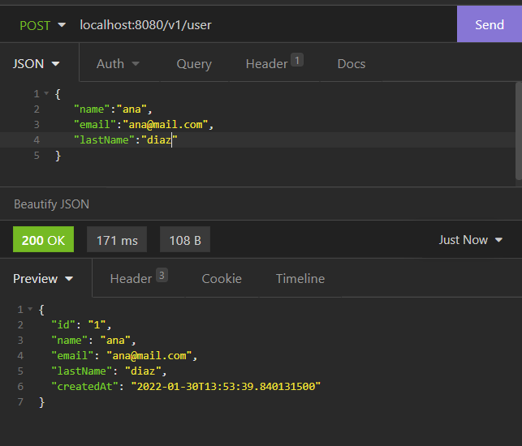
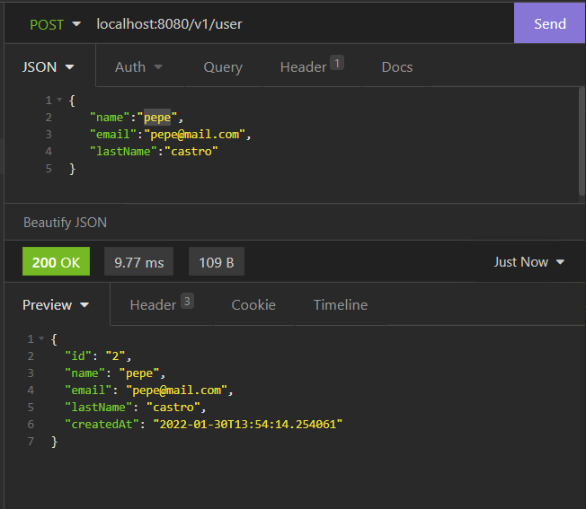
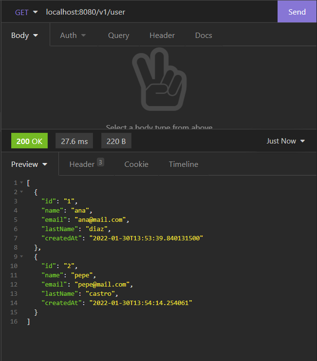
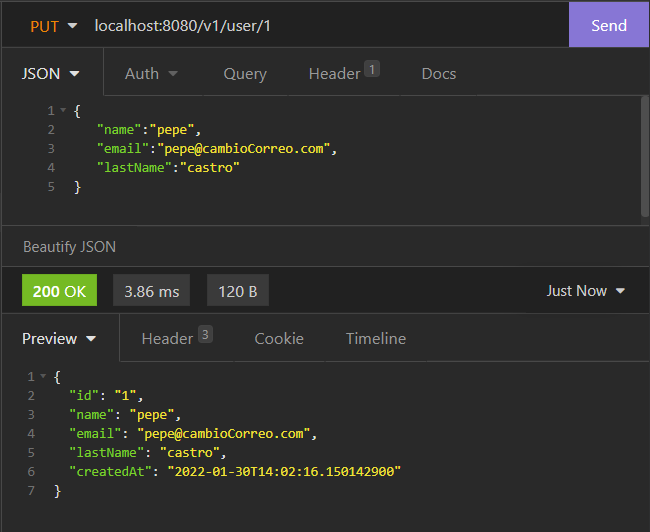
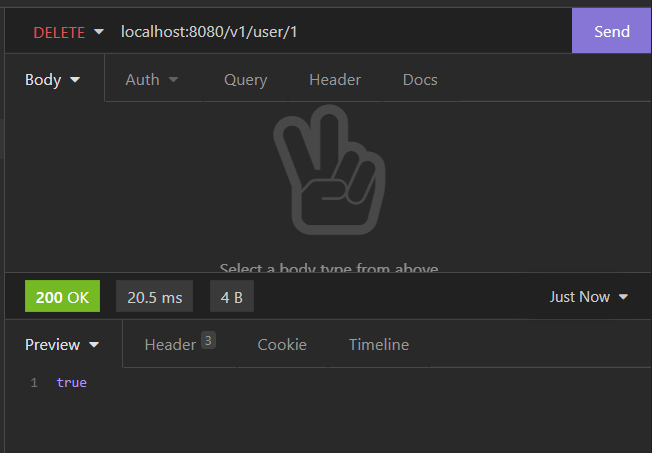
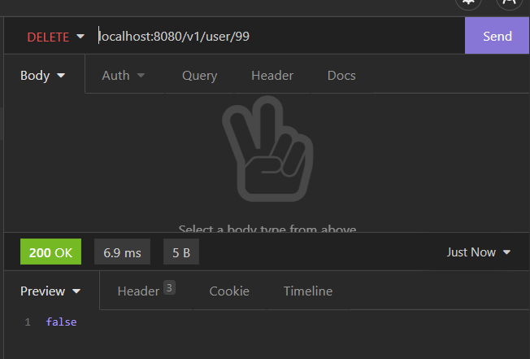
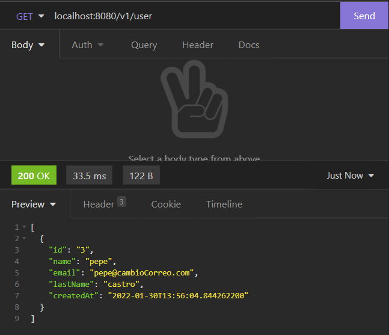

# IETI_LAB_2 
## Juan Sebastian Garcia Hincapie
## Implementing the Users Microservice RESTFUL API

## insomnia tests:

### - Post

### - Get

### - Put

verification:

### - Delete
valid: 

invalid : 

verification:

